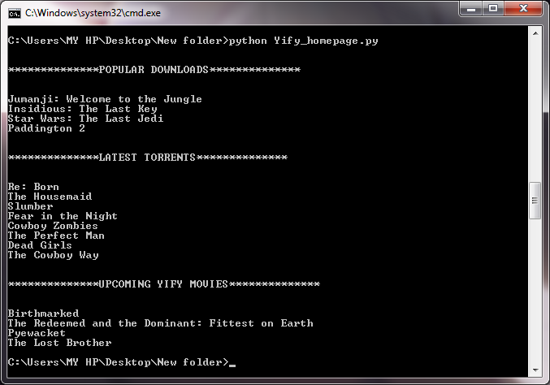

# yify_homepage
A simple python script to scrape new, popular and upcoming movie torrent names from yts.am homepage. Yify movies is a popular torrent site and unlike other torrent sites out there, its homepage is well constructed with the info about the popular, new, and upcoming torrents which keeps updating almost daily

## Prerequisites
This script needs two external dependencies  
- beautfulsoup4
- requests

To install all the requirements, go to the code directory and run the following in command prompt;

`pip install -r requirements.txt`

## Getting Started
The main executable file is `yify_homepage.py`
Change to the code directory in command prompt and run 

`python yify_homepage.py`

## Screenshot
test run on 4/3/2018

